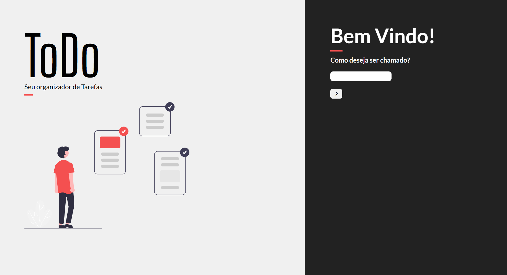

<!-- Sobre o que é? -->
# ToDo - Organizador de tarefas

<!-- Linguagens Utilizadas -->
###  Linguagens Utilizadas

- HTML
- CSS com SASS
- JS com React.JS

### Objetivos

O intuito deste projeto é realizar um webapp de lista de tarefas. Nele você pode adicionar tarefas descrevendo sobre o que é, como deve ser feita, a data limite e a categoria que se enquadra.

Visando a realização de um aplicativo SPA (Single Page Application), utilizei a biblioteca React para poder construir meu ToDo. Foi um belo desafio já que tive que lidar com diferentes páginas e diferentes filtros. Sendo meu segundo aplicativo criado com a biblioteca, acredito que tenha sido muito produtivo para o aprendizado.

Um dos destaques foram as animações agradáveis de uma página para outra. Acredito que a mais interessante fazer foi a da página inicial para as páginas subsequentes. Uma das minhas maiores preocupações é sempre realizar uma experiência fluida para o usuário que está navegando em minhas aplicações. 

As tarefas podem ser vistas na página de lista de tarefas e podem ser filtradas, sendo com os filtros pre-existentes ou com a pesquisa. Além disso, as tarefas podem ser marcadas como feitas. Isso ajuda para vermos uma visão geral das tarefas na página da home.

Para manter a aplicação simples, e focar meus estudos em React e SASS, optei por guardar as informações no localstorage do próprio navegador, como um objeto. Apesar de saber que seria interessante mexer com banco de dados, fiz isso pois meu foco não era estudar BD no momento em que realizei esse projeto. 

Como sempre, o projeto está responsivo e pode ser mexido tanto no mobile quanto no desktop.
